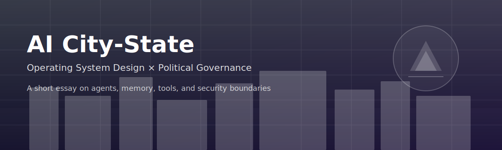
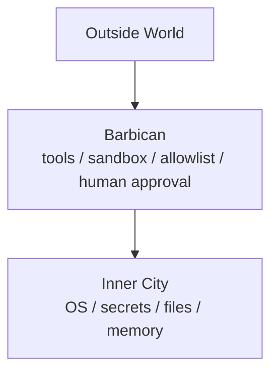

  

  
  
  

> **You are not using an AI. You are raising a city.**  
> 不是在用 AI，是在養一座城。

---

## 🌏 Read in your language

- 🇺🇸 **English**: [en.md](en.md)
- 🇹🇼 **中文**: [zh.md](zh.md)

---

## 🧭 The Core Architecture

---

## 📚 Essays (Series Index)

- **01** — [The AI City-State / AI 城邦論](essays/01-ai-city-state.md)
- **02** — [The Seal & the API Key / 虎符與 API Key](essays/02-seal-and-api-key.md)
- **03** — [The Imperial Archives / 國史館與記憶](essays/03-imperial-archives-and-memory.md)
- **04** — [Morning Court Audits / 早朝與風險報告](essays/04-morning-court-audits.md)

---

## ✨ What This Repo Is

A short, sharable essay set about AI agents:

- **Models** are strategists (smart, persuasive, fallible)
- **Tools** are troops (powerful, potentially destructive)
- **Memory** is an archive (useful, sensitive)
- **Security** is city design (permission, approval, audit)

This repo is intentionally small, portable, and GitHub-friendly.

---

## 🧷 Quick Share

- Send the repo link, or
- copy/paste any `essays/*.md` file into Notion / Obsidian / a blog.

---

## 🧾 License

MIT — see [LICENSE](LICENSE).
