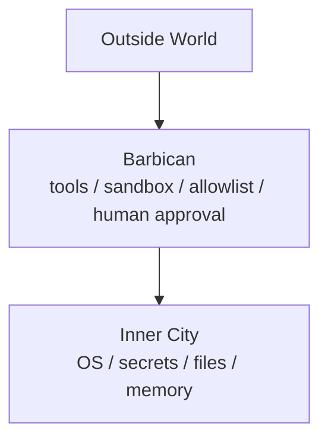

# 🏯 The AI City-State

## When a Large Language Model Moves Into Your Machine

It started with something simple.  
We just wanted AI to count how many `.py` files were on the desktop.

Cloud AI said:

> “I can’t do that — but here’s the command.”

A local agent walked into the terminal and did it.

That was the moment everything changed.

**This was no longer a chatbot.**  
This was an **acting entity**.

---

## 🧠 The Strategist Has Entered the City — But Must Not Hold the Seal of Command

A large language model is like a brilliant strategist:

- writes poetry  
- writes deployment scripts  
- analyzes risk  
- can also be persuaded by enemy propaganda (prompt injection 😄)

The problem isn’t whether the strategist is smart.

> The problem is: what authority you let them touch.

If you hand it `sudo`, you don’t have an assistant anymore — you have an **automated regent**.

---

## 🏯 That’s Why You Need the Barbican

The LLM stays on the city wall making plans:

- “We should update the system.”
- “We should post this tweet.”
- “We need to install a Python package.”

But:

- Who opens the gate → the policy engine  
- Who holds the key → the runtime  
- Whether troops actually move → human approval  

The strategist never runs down and opens the gate themselves.

---

## 🔑 API Keys Are Command Seals, Not Sticky Notes

The danger is not the key.

The danger is:

> putting the imperial command seal on the strategist’s desk.

Correct design:

The strategist issues orders.  
The general (the tool runtime) executes them.

---

## 🧾 The Daily Log Is Actually the Morning Court

A daily agent report is not logging.

It is governance:

- troop movement  
- near-open gates  
- overpowered generals  
- weak walls  

This is **AI governability**.

---

## 🧨 The Real Risk Is Not That AI Is Dumb — It’s That It Can Act

Modern agents can:

- install packages  
- control browsers  
- run shell commands  
- post on your behalf  

Without a barbican, you get:

> a calm, logical, highly efficient superuser with autonomy.

---

## 🐉 The Future Competition Is Not About the Model — It’s About the City Design

Model capability will converge.

City design will not.

AI architecture becomes:

**Operating System Design × Political Governance**

---

## 🍶 Conclusion: You’re Not Using AI — You’re Raising a City

Cloud ChatGPT: a strategist outside the walls.  
Local agents: the strategist lives inside the city.

The real questions:

- How many gates?
- Who holds the keys?
- Do we hold court every morning?

**This is city-state design for the age of AI.**
