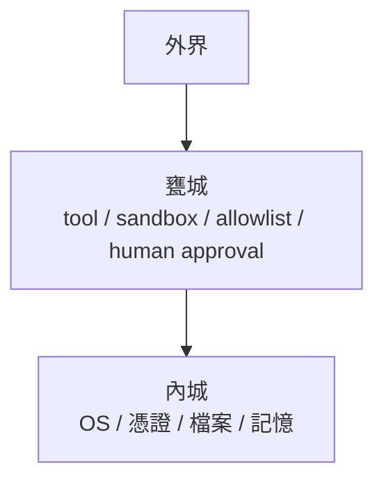

# 🏯 AI 城邦論：當大型語言模型住進你的主機裡

一開始，我們只是想讓 AI 幫忙數一下桌面上有幾個 `.py` 檔案。

雲端的 ChatGPT 說：  
「我做不到，但你可以自己打指令。」

本地 agent 則直接走進你的 terminal，敲鍵盤、跑指令、看輸出。

那一刻你才發現：

**這不再是聊天機器人。**  
這是一個會行動的存在。

---

## 🧠 軍師進城，但不能讓他拿兵符

大型語言模型像軍師：

- 會寫詩  
- 會寫 deployment script  
- 會分析風險  
- 也會被敵軍嘴炮帶節奏  

問題不在聰不聰明，而在：

> 你讓他碰到什麼權限

給他 `sudo`，你得到的不是助理，而是 **攝政王**。

---

## 🏯 所以你需要甕城

LLM 在城樓上出主意：

- 我們應該更新系統  
- 我們應該發推文  
- 我們應該安裝套件  

但：

- 誰開門 → policy engine  
- 誰拿鑰匙 → runtime  
- 是否執行 → human approval  

軍師不能自己衝下去開城門。

---

## 🔑 API key 是虎符，不是便利貼

危險的不是 key。

危險的是：

> 把虎符放在軍師桌上。

正確設計：

軍師下令，將軍動兵。

---

## 🧾 每日工作日誌，其實是早朝

每日報告不是 log。

是治理：

- 今日調兵遣將  
- 哪個門差點被打開  
- 哪個將領權限過大  
- 哪段城牆需要加固  

這叫：

**AI 的可治理性（governability）**

---

## 🧨 真正的風險不是 AI 太笨，而是 AI 太能做事

現代 agent 可以：

- 裝套件  
- 控瀏覽器  
- 跑 shell  
- 幫你發文  

沒有甕城，你得到的是：

> 一個冷靜又高效的 root。

---

## 🐉 未來的競爭不在模型，而在城防

模型能力會趨同。

城防設計不會。

AI 架構將變成：

**作業系統設計 × 國家治理學**

---

## 🍶 結語：你不是在用 AI，你是在養一座城

雲端 AI：城外軍師  
本地 agent：軍師進城  

真正的問題變成：

- 有幾道城門？
- 誰拿鑰匙？
- 有沒有早朝？

**這是 AI 時代的城邦設計學。**
